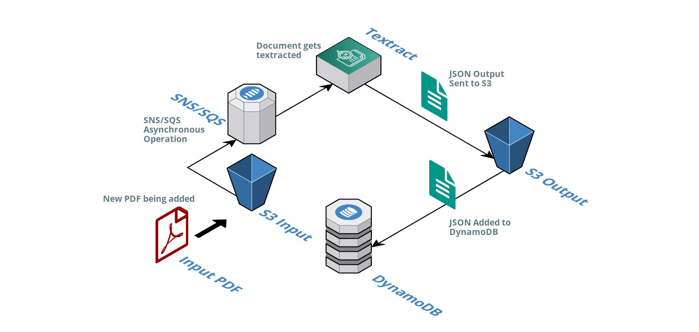

# Automated AWS Textract using S3, Lambda, & DynamoDB

## Abstract:

#### The purpose of this project is to automate the process of digitizing raw PDF documents. Two S3 buckets were created acting as input and output buckets. Two lambda functions were also prepared in order detect the addition of files to both digitize PDFs, and send their contents to DynamoDB. The flow of information was managed through asynchronous processes using SNS and SQS. The final output of this project is an AWS bucket configured to automatically detect new documents, digitizes them, and logs their contents to DynamoDB.

## Resources Used:
- S3: Two S3 buckets that act as input and output locations
- Textract: To digitize documents and convert raw PDFs to searchable text
- SQS: To organize and manage the flow of documents in the Textracting process
- SNS: To notify different components of task completion
- Lambda: Serverless compute services to ignite Textract, and log to DynamoDB
- DynamoDB: A NoSQL database to log the output data of Textract.

## Instructions and Documentation:

#### Please see my Medium.com article: [Automating Text Extraction and Data Preprocessing using AWS Textract, Lambda & DynamoDB](https://towardsdatascience.com/automating-text-extraction-and-data-preprocessing-using-aws-textract-lambda-dynamodb-e3de318d9122)

